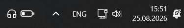
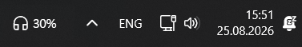
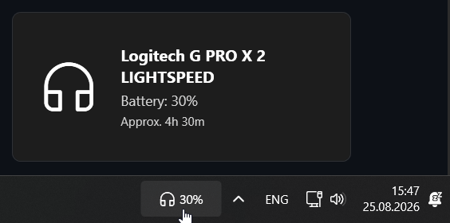
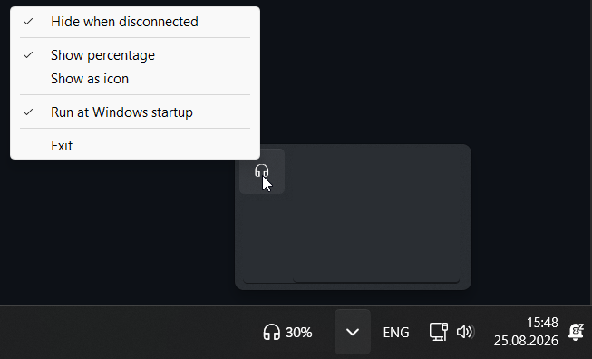

[🇷🇺 Русский (Russian)](README.ru.md) | [🇬🇧 English](README.md)

# HeadsetControl Taskbar Battery Indicator

[](https://github.com/nikpsov/headsetcontrol-taskbar-battery-indicator/releases/latest) [](https://github.com/nikpsov/headsetcontrol-taskbar-battery-indicator/tags)

Легковесное и быстрое приложение для Windows, которое отображает уровень заряда батареи различных беспроводных игровых гарнитур прямо на панели задач и в виде современного интерактивного оверлея.

<!-- Скриншоты -->




## Особенности
- **Нативная интеграция в память:** Прямое взаимодействие с библиотекой `HeadsetControl` через C-API без вызова сторонних консольных процессов и задержек.
- **Индикатор на панели задач:** Отслеживайте уровень заряда вашей беспроводной гарнитуры прямо на панели задач (проценты или иконка батареи).
- **Интерактивное всплывающее окно (Flyout):**
  - Отображение текущего процента заряда, статуса зарядки и модели гарнитуры.
  - Расчётное оставшееся время работы от батареи или время до полного заряда.
  - Точные данные о вольтаже аккумулятора (mV), если поддерживается устройством.
  - **Таймер автоотключения (Inactive Sleep Timer):** Быстрая настройка перехода в спящий режим (*Off, 5m, 15m, 30m, 1h*).
- **Поддержка множества устройств:** Поддерживает широкий спектр гарнитур Logitech (включая протокол Centurion / G PRO X 2), SteelSeries, Corsair, HyperX, Razer, Astro и других.
- **Индикация зарядки:** Отображение реального статуса зарядки (молния ⚡ / зеленый индикатор при подключении провода).
- **Настраиваемость:** Скрытие индикатора при отключении гарнитуры, выбор стиля отображения (проценты или иконка), светлая/тёмная тема Windows 11.
- **Автозагрузка:** Автоматический запуск вместе с Windows.
- **Уведомления:** Всплывающие предупреждения при низком уровне заряда (<= 20%).

<!-- Скриншоты -->


## Установка

1. Перейдите на страницу [Релизов (Releases)](https://github.com/nikpsov/headsetcontrol-taskbar-battery-indicator/releases/latest).
2. Скачайте `HeadsetControlTaskbarBatteryIndicatorSetup.exe` (или портативный архив `HeadsetControlTaskbarBatteryIndicatorPortable.zip`).
3. Запустите установщик и следуйте инструкциям на экране.
4. После установки приложение появится на панели задач и в системном трее.

## Сборка из исходников

### Требования:
- Windows 10/11
- Компилятор C++20 (`Clang` или `MSVC`)
- .NET Framework 4.8 / .NET 8 SDK

### Сборка:
Запустите скрипт сборки:
```cmd
build.bat
```
Скрипт автоматически скомпилирует нативную библиотеку `headsetcontrol.dll` из исходников субмодулей и соберёт исполняемые файлы `HeadsetControlTaskbarBatteryIndicator.exe`.

## Как это работает
Приложение линкует нативную библиотеку `HeadsetControl` (C++20 / C-API) и выполняет безопасный фоновый опрос USB HID-устройств без спавна процессов, отображая статус в прозрачном окне-оверлее, привязанном к панели задач Windows (`Shell_TrayWnd`).

## Благодарности и используемые проекты

Этот проект создан благодаря наработкам открытого сообщества:

- **[HeadsetControl](https://github.com/Sapd/HeadsetControl)** (автор @Sapd)  
  *Что используется:* Ядро библиотеки на C++20 с протоколами взаимодействия и реестром поддерживаемых гарнитур. Подключено как Git-сабмодуль (`vendor/headsetcontrol`) и компилируется в автономную `headsetcontrol.dll` для прямого вызова через C-API (`headsetcontrol_c.h`).
- **[hidapi](https://github.com/libusb/hidapi)** (авторы libusb / Alan Ott)  
  *Что используется:* Низкоуровневая кроссплатформенная библиотека работы с USB HID в Windows (через Win32 SetupAPI), скомпилированная статически внутри `headsetcontrol.dll`.
- **[headset-battery-indicator](https://github.com/aarol/headset-battery-indicator)** (автор @aarol)  
  *Что позаимствовано:* Исходная идея компактного индикатора батареи на панели задач/в трее и базовая структура C# P/Invoke обёртки над C-API библиотеки `HeadsetControl`.
- **[QontrolPanel](https://github.com/ChrisLauinger77/QontrolPanel)** (автор @ChrisLauinger77)  
  *Что позаимствовано:* Референс реализации таймеров автоотключения Inactive Sleep Timer, вычисления вольтажа аккумулятора в mV и особенностей протокола Logitech Centurion / G PRO X 2.
